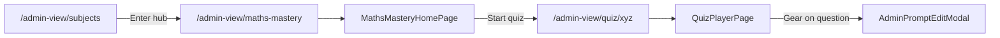

# Admin hub view and gear on questions

## Goal

- **Enter hub in admin view** → Navigate to the **actual hub page** (e.g. Maths Mastery home, Science Lab) so the experience matches normal view, not a separate toolkit list.
- **On every question** (in the quiz flow) → Show a **gear icon** at the **top right** that opens the existing update/configure flow (Save draft / Push live).

## Current behavior (to change)

- With `basePath === '/admin-view'`, [MainAppRoutes](src/routes/MainAppRoutes.tsx) registers routes that **override** hub paths with [AdminSubjectToolkitPage](src/pages/admin-view/AdminSubjectToolkitPage.tsx). So `/admin-view/maths-mastery` shows a list-of-questions toolkit instead of the real Maths Mastery home.
- [QuizPlayerPage](src/pages/QuizPlayerPage.tsx) already shows an **Edit (pencil)** button at top-right when in admin view; it opens [AdminPromptEditModal](src/components/admin-view/AdminPromptEditModal.tsx). You want this to be a **gear** icon instead, with the same behavior.

## 1. Show real hub when in admin view (routing)

**File: [src/routes/MainAppRoutes.tsx](src/routes/MainAppRoutes.tsx)**

- **Remove** the block that renders `AdminSubjectToolkitPage` for each `FEATURED_HUBS` path when `basePath === '/admin-view'` (the block that maps hub paths to `<AdminSubjectToolkitPage hub={hub} />`).
- After removal, `/admin-view/maths-mastery` will be matched by the existing `<Route path={p('/maths-mastery')} element={<MathsMasteryHomePage />} />` (and similarly for other hubs), so the hub will render exactly as in normal view.
- "Enter hub" in [SubjectsPage](src/pages/SubjectsPage.tsx) already navigates to `${adminView.basePath}${hub.hubPath}` when in admin view, so no change there.

Result: In admin view, clicking Enter hub opens the real subject hub (e.g. Maths Mastery home). From there the user can start a quiz and see questions with the gear.

## 2. Gear icon on every question (QuizPlayerPage)

**File: [src/pages/QuizPlayerPage.tsx](src/pages/QuizPlayerPage.tsx)**

- **Replace the admin edit control** so it uses a **gear (Settings)** icon instead of the pencil (Edit2):
  - Use the existing `Settings` import from `lucide-react` (already used elsewhere on the page).
  - Change the button that currently uses `<Edit2 size={18} />` to use `<Settings size={18} />`.
  - Set the button `title` to something like `"Configure question (admin)"` so it’s clear it opens the edit/configure modal.
- **Keep** the same position (`absolute top-4 right-4`), the same `onClick` (open modal with current prompt), and the same modal logic (AdminPromptEditModal with save draft / cancel / push live). No changes to modal behavior.

Questions are only shown in a “single question + gear” flow in the **quiz player**; Science Lab topic tests / quick checks use different data (flashcard config), so the only place that needs the gear is [QuizPlayerPage](src/pages/QuizPlayerPage.tsx).

## Flow summary

## Files to change

| File | Change |
|------|--------|
| [src/routes/MainAppRoutes.tsx](src/routes/MainAppRoutes.tsx) | Remove the `basePath === '/admin-view' && FEATURED_HUBS.map(...)` block that renders `AdminSubjectToolkitPage` for hub paths. Optionally remove the now-unused `AdminSubjectToolkitPage` and `FEATURED_HUBS` imports if nothing else uses them in this file. |
| [src/pages/QuizPlayerPage.tsx](src/pages/QuizPlayerPage.tsx) | Replace the admin edit button icon from `Edit2` to `Settings` and set `title="Configure question (admin)"` (or similar). |

## Optional (no requirement)

- **AdminSubjectToolkitPage** can stay in the codebase (e.g. for a future “list all questions” entry from the admin toolbar or a dedicated route like `/admin-view/toolkit/:hubId`). The plan does not require adding or removing that page; only the route override for hub paths is removed so the real hub shows when entering from subjects.
