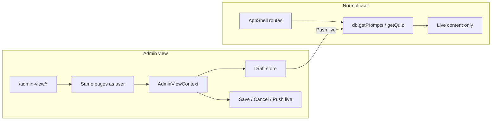

# Admin View Page: Edit and Publish Content

## Current state

- **Auth**: [AdminLayout.tsx](src/admin/AdminLayout.tsx) already gates `/admin` with passcode `admin123` (sessionStorage key `grade9_admin_auth`). No backend auth.
- **Questions**: Stored in Supabase `prompts` table; edited in admin via [PromptsPageEnhanced.tsx](src/admin/PromptsPageEnhanced.tsx) with direct `db.updatePrompt()` (no draft/live).
- **Diagrams**: Stored in Supabase `diagrams` table; edited in [DiagramEditor.tsx](src/admin/DiagramEditor.tsx) with direct update/insert.
- **Flashcards**: **Mixed sources** — Science Lab uses [scienceLabFlashcards.ts](src/config/scienceLabFlashcards.ts) (config), Psychology uses [psychologyHubData.ts](src/config/psychologyHubData.ts), etc. Many are code/config, not DB.
- **Routing**: Main app uses [App.tsx](src/App.tsx) with `<AppShell>` wrapping a large nested `<Routes>` block (e.g. `/`, `/subjects/:subjectId`, `/quiz/:quizId`, hub routes). No draft/publish or status columns exist today.

## Architecture

- **Admin view** = same UI as the student (same page components) under `/admin-view/`*, with an admin toolbar and a context that provides draft-aware data and actions.
- **Drafts** = stored in a new Supabase table; “Save” writes drafts, “Push live” copies draft → live table and deletes draft, “Cancel” discards draft.

## 1. Route and auth for `/admin-view`

- **Route**: Add a top-level route `/admin-view` that uses a layout component (e.g. `AdminViewLayout`) which:
  - Reuses the same passcode check as [AdminLayout.tsx](src/admin/AdminLayout.tsx) (read `grade9_admin_auth` from sessionStorage; if missing or wrong, show the same login form with password `admin123`).
  - Once authenticated, renders the **same** `<AppShell>` and the **same** nested route tree as the main app, but under the path prefix `/admin-view`. So URLs become `/admin-view`, `/admin-view/subjects`, `/admin-view/quiz/:quizId`, `/admin-view/science-lab/...`, etc.
- **Avoid duplicating 100+ route definitions**: Extract the main app’s nested route list (the `<Route path="/" element={<SubjectsPage />} />` … block) into a shared config or a single component (e.g. `MainAppRoutes`) that accepts an optional `basePath` or a `isAdminView` prop. Then:
  - Default app: `<Route path="*" element={<AppShell><MainAppRoutes /></AppShell>} />`
  - Admin view: `<Route path="/admin-view" element={<AdminViewLayout />}><Route path="*" element={<AppShell><MainAppRoutes isAdminView /><AdminViewToolbar /></AppShell>} />}</Route>`
- **AdminViewLayout** can wrap its children in an **AdminViewProvider** (React context) that signals `isAdminView: true` and exposes draft APIs (see below). A small **AdminViewToolbar** (floating or top bar) can show “Viewing as admin”, link to “Drafts”, and Log out.

## 2. Draft storage and API

- **New Supabase table** (e.g. `content_drafts`):
  - Columns: `id` (uuid), `entity_type` (`'prompt'` | `'diagram'`), `entity_id` (uuid of prompt or diagram), `draft_json` (jsonb), `updated_at` (timestamptz). Optional: `updated_by` if you add auth later.
  - Unique on `(entity_type, entity_id)` so one draft per entity.
- **DB layer** in [src/db/client.ts](src/db/client.ts):
  - `getDraft(entityType, entityId)` → draft payload or null.
  - `saveDraft(entityType, entityId, draftJson)` → upsert into `content_drafts`.
  - `deleteDraft(entityType, entityId)` → remove row.
  - `pushDraftLive(entityType, entityId)` → read draft, write to `prompts` or `diagrams` (and optionally `diagram_metadata` for prompts), then delete draft. Use a small mapping so one function can dispatch to prompt vs diagram update logic.
- **AdminViewContext** (e.g. `src/contexts/AdminViewContext.tsx`):
  - Exposes `isAdminView`, plus for each entity type: `getEffectivePrompt(promptId)`, `getEffectiveDiagram(diagramId)` (returns draft if present, else live from db).
  - Exposes `saveDraft(type, id, payload)`, `cancelDraft(type, id)`, `pushDraftLive(type, id)`; after push, invalidate any local cache / refetch so UI shows live data.

## 3. “View as normal user” with edit controls

- **Data flow in admin view**:
  - Pages that normally call `db.getPromptsByIds`, `db.getQuiz`, etc. should, when `isAdminView` is true, either:
    - Call a wrapper (e.g. `usePromptsWithDrafts(quizId)` or `usePrompt(promptId)`) that uses AdminViewContext to return draft-overridden data, or
    - Keep calling `db` but have a higher-level provider that merges drafts into the data (e.g. context fetches drafts for visible prompt IDs and merges before passing to children). Prefer a single place (e.g. hooks used by QuizPlayerPage and by any admin-only question list) so student path stays unchanged.
  - For diagrams, [DiagramRenderer](src/components/DiagramRenderer.tsx) (or the component that fetches diagram by id) should in admin view check for a draft and use that if present; otherwise fetch from `diagrams` as today.
- **Edit entry points**:
  - **Questions**: On quiz play page (e.g. [QuizPlayerPage.tsx](src/pages/QuizPlayerPage.tsx)), when `isAdminView`, add an “Edit” control (e.g. icon button) per question card. Click opens a modal or slide-over that reuses the same fields as [PromptsPageEnhanced](src/admin/PromptsPageEnhanced.tsx) (question, answers, hint, explanation, type, marks, diagram_metadata, etc.). Footer: **Save draft**, **Cancel** (close and discard in-memory edits; if there was a saved draft, optionally “Revert to draft” vs “Revert to live”), **Push live**. Same pattern on any other page that renders a single prompt (e.g. topic test, question lab) by checking `isAdminView` and rendering the Edit control + modal.
  - **Diagrams**: Where a diagram is shown (e.g. inside a question or on a flashcard), in admin view show “Edit diagram”. Click can open the existing [DiagramEditor](src/admin/DiagramEditor.tsx) in a modal or navigate to `/admin-view/diagram/:id/edit` (and load diagram from context so draft is used if present). In that editor, “Save” writes to `content_drafts` (entity_type diagram), “Push live” writes to `diagrams` and deletes draft; “Cancel” closes and optionally reverts to last saved draft or live.
  - **Flashcards**: Many flashcards come from config (e.g. [scienceLabFlashcards.ts](src/config/scienceLabFlashcards.ts)). Phase 1 can **exclude** flashcard editing or support only DB-backed flashcards if any exist. Phase 2: either add a `flashcard_content` table and migrate, or allow “override” drafts (e.g. `entity_type = 'flashcard'`, `entity_id = slug`) and teach Science Lab (and other) flashcard loaders to check drafts first so admin edits can override config without code deploy.

## 4. Save / Cancel / Push live behaviour

- **Save draft**: Persist current form/editor state to `content_drafts` (upsert by `entity_type` + `entity_id`). UI: “Draft saved”; admin can leave and resume later; when they open that question/diagram again in admin view, they see the draft.
- **Cancel**: Close the editor without writing. If the editor was opened from “live” and no draft existed, nothing to do. If a draft existed, optionally offer “Revert to live” (delete draft) so the next view shows live content.
- **Push live**: Copy draft payload to the live table (`prompts` or `diagrams`), then delete the draft. Normal users immediately see the update. Show success and close editor; list/detail views in admin view should refetch or merge so they show live data.

## 5. Implementation order (recommended)

1. **Supabase**: Create `content_drafts` table and (if needed) RLS so only your app/service role can write.
2. **DB client**: Add draft CRUD and `pushDraftLive` in [src/db/client.ts](src/db/client.ts).
3. **AdminViewContext + Provider**: Implement context that provides `isAdminView`, draft-aware getters, and save/cancel/push actions.
4. **AdminViewLayout**: New layout that does passcode gate (reuse AdminLayout logic), then renders `AdminViewProvider` + AppShell + shared route tree; add small AdminViewToolbar (e.g. “Viewing as admin”, “Drafts”, Log out).
5. **Routing**: Refactor [App.tsx](src/App.tsx) so the main app routes are defined once (e.g. `MainAppRoutes` with optional `isAdminView`). Add `/admin-view/`* that renders `AdminViewLayout` and the same routes with `isAdminView` true.
6. **Question editing**: In quiz (and any other prompt-rendering page), when `isAdminView` add Edit button and modal/panel; wire form to context’s getEffectivePrompt, saveDraft, cancelDraft, pushDraftLive. Ensure quiz data source in admin view uses draft-aware prompt data.
7. **Diagram editing**: Wire diagram views in admin view to use effective diagram (draft or live); add “Edit diagram” that opens DiagramEditor (or a simplified editor) with Save draft / Cancel / Push live using the same draft API.
8. **Flashcards (optional / phase 2)**: Define policy for config-backed vs DB-backed; implement override drafts and loader changes only if in scope.

## 6. Files to add or change (summary)

| Area                                                                      | Action                                                                                                   |
| ------------------------------------------------------------------------- | -------------------------------------------------------------------------------------------------------- |
| Supabase                                                                  | New table `content_drafts` (entity_type, entity_id, draft_json, updated_at).                             |
| [src/db/client.ts](src/db/client.ts)                                      | Add getDraft, saveDraft, deleteDraft, pushDraftLive.                                                     |
| New: `src/contexts/AdminViewContext.tsx`                                  | Provider + hooks for isAdminView and draft merge + actions.                                              |
| New: `src/components/AdminViewToolbar.tsx`                                | Small bar: “Viewing as admin”, drafts link, logout.                                                      |
| New: `src/layouts/AdminViewLayout.tsx`                                    | Passcode gate (reuse constant + sessionStorage from AdminLayout), then Provider + AppShell + routes.     |
| [src/App.tsx](src/App.tsx)                                                | Extract main app routes into reusable component; add `/admin-view/`* with AdminViewLayout.               |
| [src/pages/QuizPlayerPage.tsx](src/pages/QuizPlayerPage.tsx) (or wrapper) | When isAdminView: use draft-aware prompts, add “Edit” per question and modal with Save/Cancel/Push live. |
| Question editor modal                                                     | New component or reuse PromptsPageEnhanced form in a modal; wire to AdminViewContext.                    |
| Diagram flow                                                              | Use effective diagram in admin view; add “Edit diagram” opening editor with draft actions.               |
| [src/admin/AdminLayout.tsx](src/admin/AdminLayout.tsx)                    | Optional: add “Open admin view” link so admins can jump to `/admin-view` after login.                    |

## 7. Security and UX notes

- Passcode `admin123` is acceptable for a single-tenant or internal tool; for a public app, replace with proper auth and environment-based secrets.
- Keep draft table RLS or app-level checks so only authenticated admin (or service role) can read/write drafts.
- Consider a “Drafts” page under `/admin-view/drafts` that lists all drafts (by entity_type and entity_id) so the admin can bulk push or delete.

This plan gives you a single place to browse the site as a user, edit questions and diagrams with a clear Save / Cancel / Push live workflow, and leaves room to add flashcard editing once content source strategy is decided.