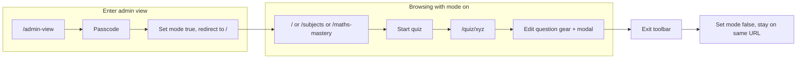

# Admin-view: persistent mode and edit questions in any hub

## Goal

1. **Persist admin view across navigation** – Do not leave admin view when entering or exiting different parts of the site (hubs, quiz, discover, etc.) unless the user explicitly clicks "Exit admin view".
2. **Edit questions in any hub** – As soon as you enter any hub while in admin view, you can edit/change questions (quiz player and any question surfaces get the edit UI).

## Current behavior (problems)

- Admin view is **tied to the URL**: it only exists when you are under `/admin-view/`*. The provider and toolbar live inside [AdminViewRouteContent](src/App.tsx) (around line 211), so they are unmounted when you leave that subtree.
- **Quiz route is top-level**: [App.tsx](src/App.tsx) mounts `<Route path="/quiz/:quizId" element={<QuizPlayerPage />} />` **outside** the admin-view tree (line 241). So if you are in admin view and click a link that goes to `/quiz/xyz` (no prefix), you hit this route and lose the admin context. Many places call `navigate('/quiz/...')` without a prefix (e.g. [DiscoverPage](src/pages/DiscoverPage.tsx), [ResultsPage](src/pages/ResultsPage.tsx), hub pages, [AppShell](src/components/AppShell.tsx) Daily Challenge).
- So any navigation that uses a non-prefixed URL (e.g. `/quiz/...`, `/discover`) drops you out of admin view.

## Approach: admin view as a global mode (not URL-based)

- **Admin view = a boolean mode** stored in sessionStorage and React state, not the `/admin-view` path.
- When the mode is **on**:
  - Wrap **all** main-app and quiz content in [AdminViewProvider](src/contexts/AdminViewContext.tsx) and show [AdminViewToolbar](src/components/AdminViewToolbar.tsx).
  - User can browse normal URLs: `/`, `/subjects`, `/maths-mastery`, `/quiz/xyz`, etc. No prefix needed; no link can “escape” admin view.
- **Enter admin view**: User goes to `/admin-view`, enters passcode (existing [AdminViewLayout](src/layouts/AdminViewLayout.tsx)), then we set the mode to true and redirect to `/` (or `/subjects`). Optionally keep a link from [AdminLayout](src/admin/AdminLayout.tsx) (“View site as admin”) that sets mode and navigates to `/` (with passcode already assumed if they’re in /admin).
- **Exit admin view**: Toolbar “Exit” clears the mode (and optionally `grade9_admin_auth`), and the user stays on the same URL.

Result: You are never “taken out” of admin view by navigation; only “Exit admin view” turns it off.

## Implementation

### 1. Admin view mode context (root level)

- Add a small **AdminViewModeContext** that holds:
  - `isAdminViewMode: boolean` – read from sessionStorage on init (e.g. key `grade9_admin_view_mode` or reuse `grade9_admin_auth` as “has passed passcode” so mode = passcode is set).
  - `setAdminViewMode: (value: boolean) => void` – updates state and sessionStorage.
- Provide this at the app root (e.g. inside `BrowserRouter`, next to existing providers in [App.tsx](src/App.tsx)). No dependency on existing `AdminViewContext`; this is only “is mode on or off”.

### 2. Conditional wrapper so provider and toolbar cover all routes when mode is on

- In [App.tsx](src/App.tsx), introduce a wrapper component (e.g. `MaybeAdminViewWrapper`) that:
  - Reads `isAdminViewMode` from the new context.
  - When **false**: renders children as today (current `Routes` with no admin provider).
  - When **true**: wraps children in `AdminViewProvider` and renders `AdminViewToolbar`, then the same `Routes` (so every route, including `/quiz/:quizId` and `/`*, runs inside the provider).
- Use this so that:
  - `<Route path="/quiz/:quizId" element={<QuizPlayerPage />} />` and  
  - `<Route path="/*" element={<MainAppCatchAll />} />`  
  both render **inside** the same `AdminViewProvider` when mode is on. So [QuizPlayerPage](src/pages/QuizPlayerPage.tsx) and all hub pages get `useAdminView()` and the edit UI without any URL change.

### 3. Enter admin view (passcode flow)

- Keep `/admin-view` as the entry route. In [AdminViewLayout](src/layouts/AdminViewLayout.tsx):
  - On successful passcode: set the new “admin view mode” to true (and keep setting `grade9_admin_auth` if you still use it for “has passed passcode”).
  - Then `navigate('/', { replace: true })` (or `navigate('/subjects', { replace: true })`) so the user lands on the main app with mode on and provider wrapping everything.
- Optional: from [AdminLayout](src/admin/AdminLayout.tsx), the existing “View site as admin” link can point to `/admin-view` (current behavior) or, if you prefer, to a handler that sets mode and navigates to `/` when the user is already authenticated in admin.

### 4. Exit admin view

- In [AdminViewToolbar](src/components/AdminViewToolbar.tsx), “Exit” should:
  - Call `setAdminViewMode(false)` (and optionally `sessionStorage.removeItem('grade9_admin_auth')`).
  - Do **not** navigate away; the user stays on the same path (e.g. still on `/quiz/xyz` or `/maths-mastery`), but the provider and toolbar unmount, so they are no longer in admin view.

### 5. Remove or simplify the `/admin-view/`* content route

- Once mode is global, you no longer need a separate **content** tree under `/admin-view/`*. Options:
  - **Option A**: Keep `<Route path="/admin-view" element={<AdminViewLayout />}>` only for the **passcode screen**. After login, redirect to `/` as above. Remove the nested `<Route path="*" element={<AdminViewRouteContent />} />` so that visiting `/admin-view/subjects` etc. is not used anymore (or make `AdminViewLayout` redirect to `/` when mode is already on).
  - **Option B**: Keep the nested route but have it redirect to the same path without the prefix when mode is on (e.g. `/admin-view/maths-mastery` → `/maths-mastery`) so old bookmarks still work.

Recommendation: **Option A** – single entry at `/admin-view` (passcode), then redirect to `/`. No `AdminViewRouteContent`; the main app and quiz routes are the only content, wrapped by the provider when mode is on.

### 6. AppShell and links

- When admin view is a **mode** (not a path), [AppShell](src/components/AppShell.tsx) no longer needs a `basePath` for “staying in admin view.” You can stop passing `basePath="/admin-view"` and use normal paths. So nav links, Daily Challenge, etc. stay as `/`, `/discover`, `/quiz/daily-challenge-1`, etc. No code changes needed in AppShell for prefixing once mode is global.
- [SubjectsPage](src/pages/SubjectsPage.tsx) currently uses `adminView?.basePath` for “Enter hub” (e.g. `${adminView.basePath}${hub.hubPath}`). With global mode, use normal `hub.hubPath` for navigation; admin view is still active because the mode is on, not because of the URL.

### 7. Edit questions in hubs

- [QuizPlayerPage](src/pages/QuizPlayerPage.tsx) already uses `useAdminView()` and shows the edit/gear UI and [AdminPromptEditModal](src/components/admin-view/AdminPromptEditModal.tsx) when `adminView?.isAdminView` is true. Once the provider wraps the app when mode is on, this works on any quiz (including from hubs) without changing the URL.
- Any other hub page that renders questions (e.g. topic tests that use the quiz player or a shared question component) will get the same behavior if they already call `useAdminView()` and show an edit control; if some hub pages render questions inline without the quiz player, add the same pattern (useAdminView + gear + AdminPromptEditModal) there as needed. From the codebase, the main question-editing surface is the quiz player; hub entry points typically start a quiz and navigate to it, so this plan covers “edit questions when you enter any hub” via the quiz flow.

## Flow summary

## Files to touch

| File                                                                       | Change                                                                                                                                                                                                                                                                                               |
| -------------------------------------------------------------------------- | ---------------------------------------------------------------------------------------------------------------------------------------------------------------------------------------------------------------------------------------------------------------------------------------------------- |
| New: `src/contexts/AdminViewModeContext.tsx` (or similar)                  | Context for `isAdminViewMode` + `setAdminViewMode`, synced with sessionStorage.                                                                                                                                                                                                                      |
| [src/App.tsx](src/App.tsx)                                                 | Add AdminViewModeProvider; add wrapper that when mode is on renders `AdminViewProvider` + `AdminViewToolbar` + same Routes; ensure `/quiz/:quizId` and `/*` both render inside that wrapper when mode is on. Simplify or remove `/admin-view` nested content route (redirect after passcode to `/`). |
| [src/layouts/AdminViewLayout.tsx](src/layouts/AdminViewLayout.tsx)         | On passcode success: set admin view mode to true, then `navigate('/', { replace: true })`. Optionally when mode is already true, redirect to `/`.                                                                                                                                                    |
| [src/components/AdminViewToolbar.tsx](src/components/AdminViewToolbar.tsx) | On Exit: call `setAdminViewMode(false)` (from new context); optionally clear `grade9_admin_auth`; do not navigate (user stays on current path).                                                                                                                                                      |
| [src/components/AppShell.tsx](src/components/AppShell.tsx)                 | When moving to global mode, stop requiring `basePath` for admin (optional cleanup).                                                                                                                                                                                                                  |
| [src/pages/SubjectsPage.tsx](src/pages/SubjectsPage.tsx)                   | When in admin view mode, “Enter hub” can use normal `hub.hubPath` (no basePath prefix) so navigation stays on the same route tree; mode stays on.                                                                                                                                                    |

## Optional follow-ups

- **AdminSubjectToolkitPage**: Can remain at a dedicated route (e.g. `/admin-view/toolkit/:hubId` or linked from the toolbar) for “list all questions for this hub” if you want that later; not required for “edit questions in any hub” which is satisfied by the quiz player + global mode.
- **Drafts link in toolbar**: Toolbar currently links to `/admin-view/drafts`. With global mode, that can stay as `/admin-view/drafts` if you keep a minimal route that only renders [AdminViewDraftsPage](src/pages/admin-view/AdminViewDraftsPage.tsx) (and that route is inside the wrapper that has the provider), or you move the drafts page to e.g. `/drafts` and show it only when mode is on.

